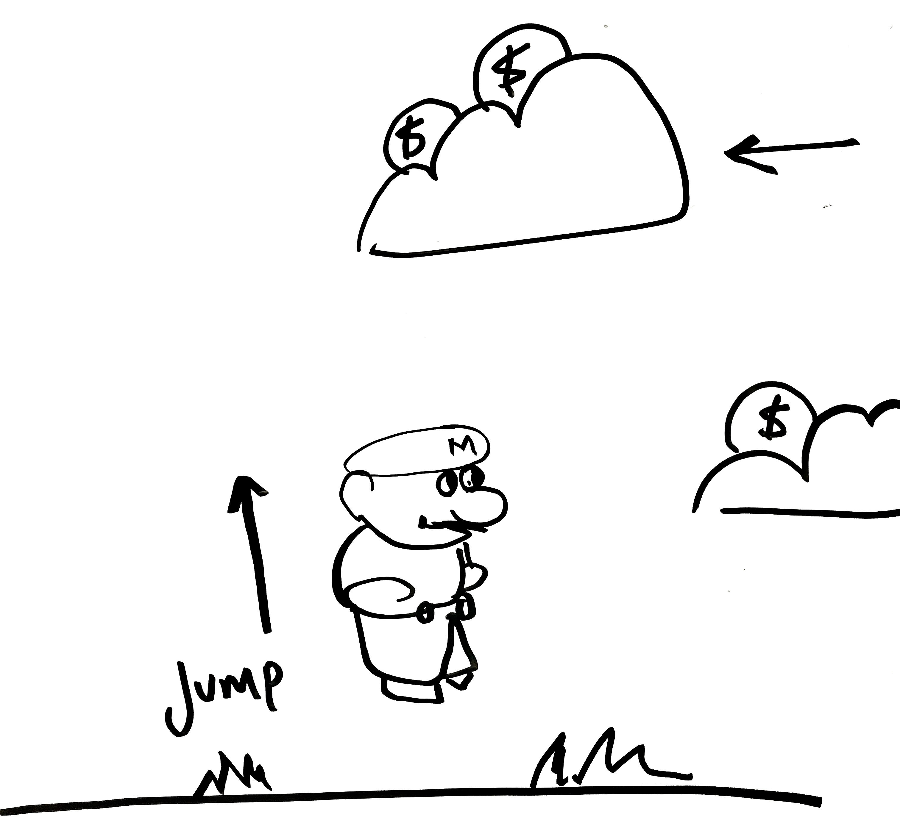

# Documento de Requerimientos del Producto (PRD)

## Requerimientos del Sistema

- El sistema debe poder recibir datos desde un dispositivo Arduino Esplora conectado a un puerto COM específico (por ejemplo, COM12).
- Se requiere el uso de la librería p5.serialport junto con un servidor intermedio desarrollado en Node.js para gestionar la comunicación serial.
- El servidor Node.js será responsable de procesar los datos recibidos desde el Arduino Esplora y ponerlos a disposición del navegador web para su uso en el juego.

## Especificaciones de la Primera Iteración del Juego

- El juego será una versión esquemática (prototipo visual simple).
- Mario será representado únicamente por un rectángulo.
- Las nubes y las monedas serán representadas por elipses.
- No se utilizarán gráficos avanzados ni sprites en esta versión inicial; el enfoque será funcional y esquemático.
# 📄 Mario grita y se hace rico - Product Requirements Document (PRD)

## Visión General



* Mario estará de pie en una pradera, ubicado en una posición central en pantalla.
* Nubes entrarán de derecha a izquierda portando monedas o elementos dañinos.
* El objetivo del jugador es recolectar monedas evitando los objetos dañinos.
* La interacción se realizará exclusivamente con el **micrófono integrado de la Arduino Esplora**.

---

## Controles y Entradas

* **Entrada principal:** micrófono de la Arduino Esplora.
* **Mapa de control:**

  * Intensidad de la voz → Altura del salto de Mario.

    * Voz baja: salto corto.
    * Voz media: salto medio.
    * Voz fuerte: salto alto.
* No se utilizarán otros sensores ni botones de la placa.

---

## Mecánica de Juego

* **Acción principal:** Mario salta para atrapar monedas o esquivar objetos dañinos.
* **Objetivo:** recolectar la mayor cantidad de monedas posibles.
* **Riesgo:** perder puntos/vida al chocar con un objeto dañino en una nube.
* **Progresión:** las nubes aparecen a diferentes alturas y con velocidad variable para aumentar la dificultad.

---

## Forma de Juego y Diagrama

### Descripción

* El jugador produce sonidos en el micrófono para controlar el salto.
* Las nubes se mueven automáticamente de derecha a izquierda.
* El juego se centra en la sincronización entre el momento del salto y la posición de las nubes.

### Esquema (simplificado)

```
Micrófono (voz) → Intensidad detectada → Altura de salto de Mario
       ↓
    Mario en pradera (posición fija)
       ↓
   Nubes con monedas → Recolectar
   Nubes con daño   → Evitar
```

---

## 5. Requerimientos del Prototipo

* **Hardware:** Arduino Esplora (solo micrófono).
* **Software:** entorno de visualización (ej. p5.js, Processing o motor gráfico ligero).
* **Alcance:**

  * Incluye: mecánica básica de salto con voz, aparición de nubes con monedas y objetos dañinos.
  * Excluye: niveles múltiples, animaciones avanzadas, control con otros sensores.
* **Criterios de éxito:**

  * El jugador puede controlar con claridad la altura del salto mediante su voz.
  * Se logra al menos un ciclo completo de juego (recolectar monedas y esquivar objetos dañinos).

---

## 🚀 Instalación y Uso

### Requisitos Previos
- Node.js (versión 14 o superior)
- Arduino Esplora conectado al puerto COM
- Puerto serial disponible (por defecto COM12)

### Instalación
```bash
# Clonar el repositorio
git clone [url-del-repositorio]
cd mario-gritaysehacerico

# Instalar dependencias
npm install
```

### Configuración del Arduino
1. Conecta el Arduino Esplora al puerto COM12 (o configura otro puerto)
2. Asegúrate de que esté enviando datos en formato: `90,112,1023,30,1023,0,77,72,195,1,1,1,1`
3. La velocidad debe ser 9600 baud
4. El micrófono debe estar en la **sexta posición** (índice 5) de los datos

### Ejecutar el Juego
```bash
# Opción 1: Script automatizado
./start.sh

# Opción 2: Comando directo
npm start

# Opción 3: Con puerto personalizado
SERIAL_PORT=COM3 npm start
```

### Acceso al Juego
- Abre tu navegador en: `http://localhost:3000`
- Verifica que el estado del Arduino aparezca como "Conectado"
- ¡Grita para hacer que Mario salte!

### Controles
- **🎤 Micrófono:** Controla la altura del salto de Mario
- **Umbral mínimo:** 100 (evita saltos accidentales)
- **Rango de intensidad:** 100-1024 → Fuerza de salto variable
- **Cooldown:** 300ms entre saltos

### Elementos del Juego (Versión Esquemática)
- **Mario:** Rectángulo rojo (40x50px)
- **Monedas:** Elipses doradas (30px diámetro) - +100 puntos
- **Nubes:** Elipses blancas decorativas
- **Fondo:** Gradiente de cielo azul con suelo verde

---

## 🛠️ Estructura del Proyecto

```
mario-gritaysehacerico/
├── server.js              # Servidor Node.js con Socket.IO
├── package.json           # Dependencias del proyecto
├── start.sh              # Script de inicio automatizado
├── ARDUINO_CONFIG.md     # Configuración detallada del Arduino
├── public/               # Archivos del cliente web
│   ├── index.html        # Página principal del juego
│   └── game.js           # Lógica del juego con p5.js
└── README.md             # Este archivo
```

---

## 🔧 Tecnologías Utilizadas

- **Backend:** Node.js, Express, Socket.IO, SerialPort
- **Frontend:** p5.js, HTML5, CSS3, JavaScript ES6
- **Comunicación:** WebSockets (Socket.IO)
- **Hardware:** Arduino Esplora (micrófono)

---

## 📡 API del Sistema

### WebSocket Events
- `arduinoData`: Datos del Arduino en tiempo real
- `serialStatus`: Estado de conexión del puerto serial

### HTTP Endpoints
- `GET /`: Página principal del juego
- `GET /api/status`: Estado del sistema (JSON)

---

## 🐛 Resolución de Problemas

### Arduino no se conecta
1. Verifica que el Arduino esté conectado al puerto correcto
2. Asegúrate de que no esté siendo usado por otro programa
3. Cambia el puerto con: `SERIAL_PORT=COMX npm start`

### El micrófono no responde
1. Verifica que los datos lleguen en el formato correcto
2. Comprueba que el micrófono esté en la posición 5 (sexta posición)
3. Ajusta el umbral mínimo si es necesario

### Problemas de rendimiento
1. Cierra otras aplicaciones que usen el puerto serial
2. Verifica la velocidad de conexión (9600 baud)
3. Comprueba la consola del navegador para errores

---

## 📝 Próximas Mejoras

- [ ] Obstáculos y elementos dañinos en las nubes
- [ ] Sistema de vidas y game over
- [ ] Niveles de dificultad progresiva
- [ ] Sprites y animaciones avanzadas
- [ ] Sistema de puntuación global
- [ ] Efectos de sonido y música

